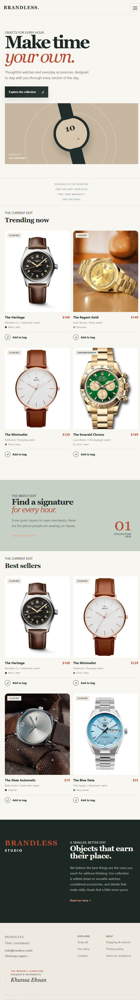

# Brandless Watches

> A considered React storefront for watches and everyday timepieces, designed and developed by **Khansa Ehsan**.



Brandless is a frontend ecommerce showcase built with React and Vite. It demonstrates a complete shopping journey before a backend is connected: product discovery, filtering, product details, persistent cart behavior, responsive checkout, order confirmation, theme switching, and support handoffs.

## The project idea

This project intentionally proves that strong product experiences do not require an oversized stack. It uses:

- Plain CSS instead of Tailwind
- React Context instead of Redux
- LocalStorage instead of a database for the demo cart
- Native browser validation instead of a form library
- Small, focused components instead of unnecessary abstraction

That simplicity is the point. Good architecture comes from clear ownership, reusable patterns, accessible interactions, and disciplined visual decisions, not from adding tools for their own sake. Brandless is a practical example of how a focused frontend can still feel polished, premium, and production-minded.

## Highlights

- Editorial luxury storefront with responsive mobile layouts
- Product catalog with search, category, brand, color, and price filters
- Product detail pages with recommendations and purchase information
- Cart quantity merging and LocalStorage persistence
- COD checkout with shipping, tax, subtotal, and final total breakdown
- WhatsApp order handoff with a prefilled order message
- Persistent light/dark theme with responsive hover and focus states
- Confirmation flow preserving the purchased order snapshot
- Contact, shipping, privacy, terms, and creator-credit pages

## Run locally

```bash
npm install
npm run dev
```

Production checks:

```bash
npm run lint
npm run build
```

## Optional WhatsApp setup

WhatsApp is an optional browser handoff, not a backend integration. When configured, it supports:

1. A prefilled checkout message containing products, customer details, address, and totals.
2. Direct support links in the footer and Contact page.

Create a local `.env` file from `.env.example`:

```env
VITE_WHATSAPP_NUMBER=923001234567
```

Use digits only with the country code. The number is public client configuration, so use a business number rather than a private secret. Without it, WhatsApp actions remain unavailable instead of opening a broken generic link.

Do not commit `.env`. It is ignored by Git; `.env.example` is the safe template to share.

## Email support

The Contact form validates its fields and opens a prefilled `mailto:` draft. Reliable delivery, ticket creation, autoresponders, and tracking require a backend email provider.

## Data flow

- `src/data/products.json` is the catalog source.
- `Productcontext` exposes catalog data through React Context.
- `ProductCatalog` derives filtered and sorted product views.
- `Cartcontext` owns cart mutations, derived totals, persistence, and toast state.
- `Themecontext` owns the persisted light/dark preference.
- `src/config/pricing.js` centralizes shipping, tax, and order totals.
- `src/config/support.js` centralizes support email and WhatsApp URL generation.
- Checkout snapshots the order before clearing the cart for confirmation.

## Project structure

```text
src/
	components/
		catalog/       Product grid, filters, and add-to-cart action
		cart/          Persistent cart interface
		checkout/      Shipping form and order summary
		footer/        Global links and creator signature
		header/        Responsive navigation and theme toggle
		ui/            Toast feedback
	config/          Pricing and support configuration
	data/            Demo catalog data
	pages/           Product, About, Contact, and legal views
	App.jsx          Routes and provider composition
public/             Product imagery and project screenshot
```

## Frontend scope

This is a frontend showcase, not a live commerce backend. It does not persist orders on a server, process card payments, manage inventory, authenticate users, or send server-side email. A production phase would add secure order storage, inventory, authentication, payment processing, shipping-rate calculation, transactional email, and official WhatsApp Business API messaging.

Before launch, replace demo catalog content with verified inventory and confirm image usage rights.
